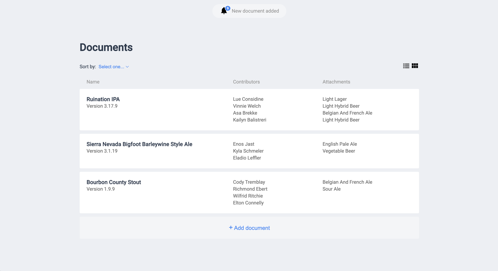
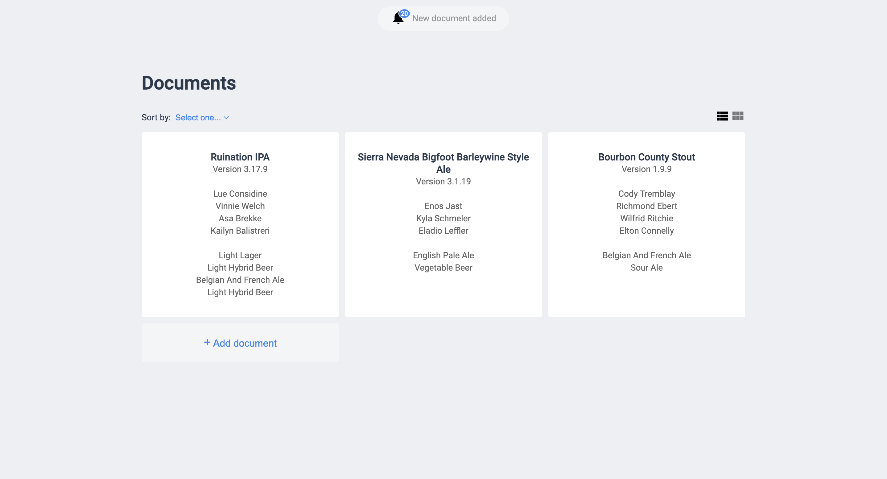

# Frontend Engineer challenge

We want you to build a web application that displays a list of documents that a customer has on their account.

A document has a name, a list of contributors, a version number, and a list of attachments.
## Features

### Required features

1. Display the most recent documents created, as a list view or as a grid view.
2. Display a notification to the user (in real time), when a new document is being
   created by other users.
3. Allow the creation of a new document. New documents created by the user should be displayed in the list.
4. Sort documents by name, version or creation date.

The documents’ data will be exposed in a simple web server that responds to requests with JSON responses over HTTP. The real time notifications will be emitted through a websocket connection. See more details about the server in the [server directory](server).

### Optional features

These features are optional, however if you completed the previous features and want to continue, here are some ideas:

1. Offline support.
2. Box notification.
3. Display dates in a relative format (e.g. "1 day ago").

  
  

## Tasks

Your task is to write a well-organized, robust and scalable application taking the following into account:

- Models the described problem with a suitable application structure that allow to add new features and to change requirements in a sustainable way
- Implement the UI, based on the provided mockups (see attachments)
- Implement different type of tests that ensure the correctness of the solution
- The application must be supported in the latest two versions of Chrome
- Implement the integrations with the sample server provided
- Include a README.md explaining your reasonings, ideas, and how to execute your
  code and run the tests

## Server integration

There are two data sources you can consume data from:

1. The document's data is exposed in a JSON over HTTP API.
2. The real-time notifications are emitted through a websocket connection.

You should set up and integrate with the testing server in the [server directory](server).

## Requirements and additional notes

- Provide source code through a public source code system (GitHub, GitLab...). **Don't show any reference to Holded in the repository**.
- Do not use frameworks such as React, Angular, Socket.io, etc.
- In case you need to include a library, please include a note explaining why it’s
  needed and which other alternatives you considered and the reasoning behind it
- Response format and examples can be found in the [server directory](server)
- There is not an API call to create a new document. You should add the document in frontend memory.
- Usage of Typescript is allowed.
- Usage of 3rd party plugins to facilitate development and testing is allowed.

## Things we are looking for with this challenge

- Maintainable and well-written code.
- You should strive for an optimal solution, but keep in mind maintainability over
  premature optimization.
- Ability to write well-written code over using a concrete framework.
- Ability to write automated tests at different levels.

  

