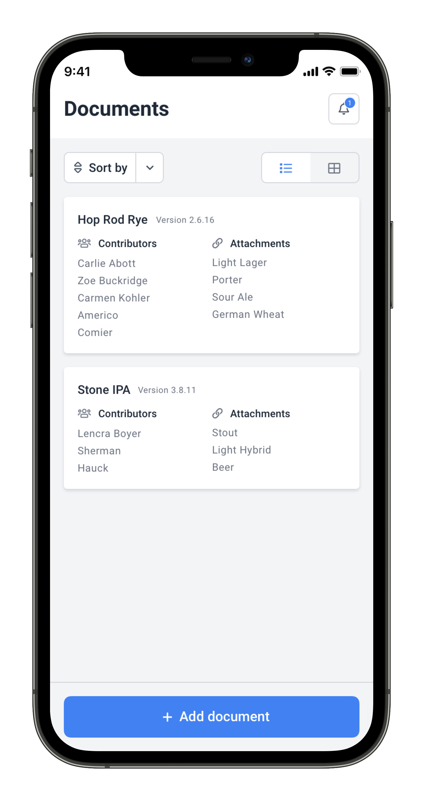
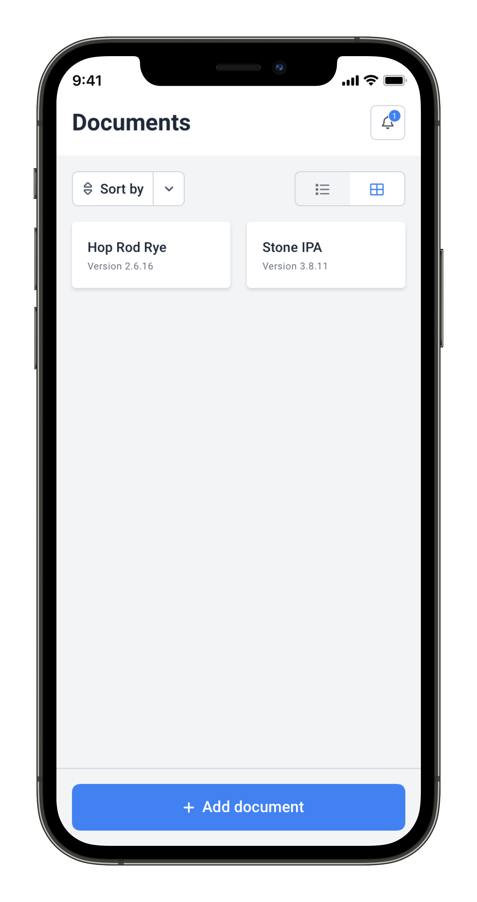

# Mobile developer challenge

We want you to build a mobile application with the following features.

## Features

### Required features

1. Display the most recent documents created, as a list view or as a grid view.
2. Display a notification to the user (in real-time), when a new document is created by other users.
3. Allow the creation of a new document.

### Optional features

These features are optional, however if you completed the previous features and want to continue, here are some ideas:

1. Offline support.
2. Local notifications.
3. Implement "pull to refresh" in the documents list and grid views.
4. Include a "share" button in the documents view with a native "share" feature.
5. Display dates in a relative format (e.g. "1 day ago").

  
  
  

## Tasks

Your task is to write a well-organized, robust and scalable application taking the following into account:

- Models the described features with a suitable application structure that allow to add new features and to change
  requirements in a sustainable way
- Implement the UI, based on the provided mockups (see above)
- Include a README.md explaining your reasonings, ideas, and how to execute your code and run the tests
- Implement different types of tests that ensure the correctness of the solution
- Implement the integrations with the server

## Server integration

There are two data sources you can consume data from:

1. The document's data is exposed in a JSON over HTTP API.
2. The real-time notifications are emitted through a websocket connection.

You should set up and integrate with the testing server in the
the [sample repository](https://github.com/holdedlab/frontend-challenge).

## Requirements and additional notes

- Provide source code, not the compiled code.
- You should share your code as a Git repository (for example, using Github, Gitlab, or similar...).
- Please make sure the name Holded are not referenced in any place in your code nor in the name of the repository
- Commit from the very beginning and commit often. We value the possibility to review your git log.
- Your app should run on iOS or Android
- You can use third party libraries, but please briefly explain in the README why it's needed and which other
  alternatives you considered and the reasoning behind including such libraries
- Please DO NOT use a database or any kind of ORM. It's OK to read the provided JSON API and the Websocket connection
  directly using basic primitives

## Things we are looking for with this challenge

- Maintainable and well-written code using good practices.
- You should strive for an optimal solution, but keep in mind maintainability over premature optimization.
- You can use third party libraries, but the more code you write yourself, the better, so that we assess your skills
  writing code.

## Things that we are NOT looking for

- Superb and pixel perfect user interface, just replicate the mockups provided and that's enough.
